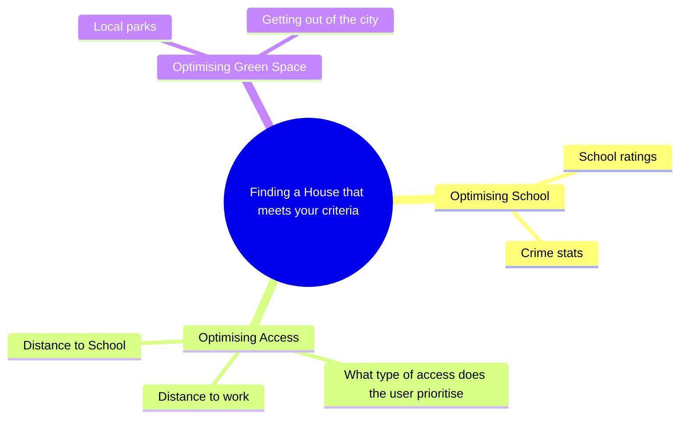
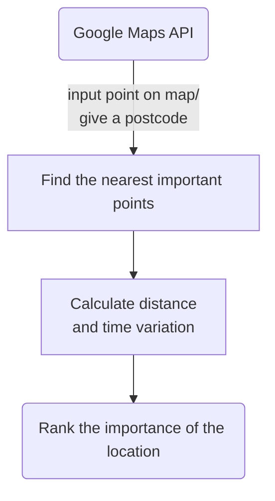

# house_optimisation
Multi-objective optimisation in the context of home buying

```mermaid
mindmap
  root((Finding a House that meets your criteria))
    Optimising School
      School ratings
      Crime stats

    Optimising Access
      What type of access does the user prioritise
      Distance to work
      Distance to School
      
    Optimising Green Space
      Local parks
      Getting out of the city

```

# High-level Process Architecture

```mermaid
flowchart TD
    A(Google Maps API)--input point on map/\ngive a postcode-->B[Find the nearest important points]-->C[Calculate distance\n and time variation] --> D(Rank the importance of the location)
```
